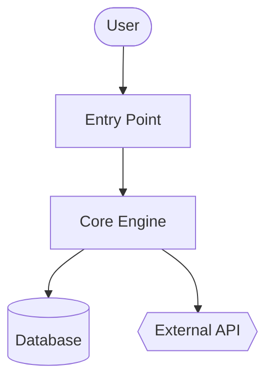
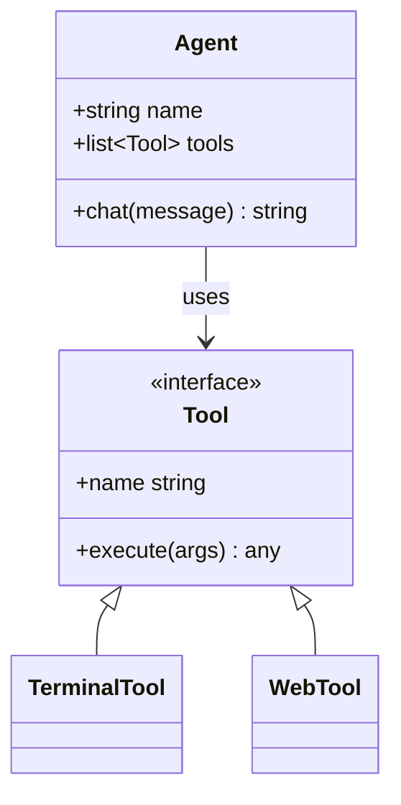
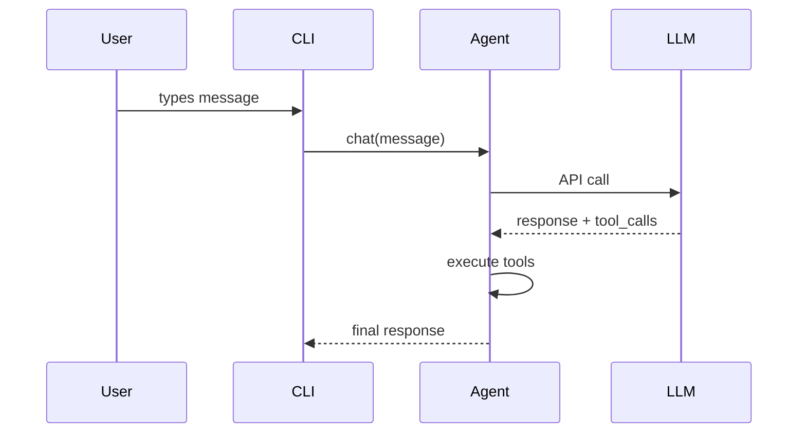

# Codebase Wiki

Generate a full wiki for any codebase: overview, architecture, per-module deep dives, and Mermaid class and sequence diagrams. It works on local repos, private repos, and any language, with the station's own tools (`fs.search`, `fs.read`, `fs.write`, `shell.exec`). No containers, no external services, no extra dependencies.

This skill produces **reference documentation** (what and how). It does not produce strategic narrative (why the project exists).

## When to use

- The Commander says "document this codebase", "generate a wiki", or "make architecture diagrams".
- Onboarding to an unfamiliar repo and wanting a structured reference.
- The Commander points at a repository URL and asks for documentation.
- A stable artifact (Markdown + Mermaid) that renders on common code hosts is needed.

Do NOT use it for:
- Single-file or single-function documentation: answer directly.
- Reference for one specific endpoint: read the file and answer inline.
- Strategic "why does this exist" narrative.
- A codebase the Commander is actively changing in this session: answer questions as they come.

## Prerequisites

- `git` on the PATH for repo SHA tracking and remote clones (WORKBENCH).
- Optional: language-breakdown statistics with the Codebase Inspection recipe (`skill.view` with `library:codebase-inspection`), if installed.

## Where the wiki goes

- Default: `code-wiki/<repo-name>/` in your workspace.
- If this session is scoped to the target project, relative paths land inside that repo. Confirm with the Commander first, and write into the repo (`docs/wiki/`) only when they ask for it.

## Quick reference

| Step | Action |
|---|---|
| 1 | Resolve the target: a local path, or `git clone --depth 50 <url>` into the workspace |
| 2 | Scan the structure: tree, manifest files, README |
| 3 | Pick 8-10 modules to document |
| 4 | Write `README.md` (overview + module map) |
| 5 | Write `architecture.md` with a Mermaid flowchart |
| 6 | Write per-module docs in `modules/` |
| 7 | Write `diagrams/class-diagram.md` (Mermaid classDiagram) |
| 8 | Write `diagrams/sequences.md` (Mermaid sequenceDiagram, 2-4 workflows) |
| 9 | Write `getting-started.md` |
| 10 | Write `api.md` if applicable, else skip |
| 11 | Write `.codewiki-state.json` |
| 12 | Report the paths to the Commander |

## Procedure

### 1. Resolve the target

- **Repository URL:** `shell.exec` with `cmd: "git clone --depth 50 <url> code-wiki-src/<repo-name>"` (a relative path inside your workspace). Then `shell.exec` with `cmd: "git rev-parse HEAD"` and `cwd` set to the clone to record the SHA.
- **Local path:** use the absolute path the Commander gave. The first file-tool call there asks the Commander to trust the folder. Record the SHA with `shell.exec` (`cmd: "git rev-parse HEAD"`, `cwd: <path>`); if it is not a git repo, record `uncommitted`.
- The repo name is the last path segment (without `.git`).

### 2. Scan the repo structure

- Tree: `fs.list` with `recursive: true` on the repo path. For a big repo, list only the top levels by listing subfolders one at a time instead. Ignore `node_modules`, virtual environments, `__pycache__`, `dist`, `build`, `target`, and hidden folders.
- Manifests: find them with `fs.search` (`target: "files"`, for example `query: "package.json"`, `pyproject.toml`, `setup.py`, `Cargo.toml`, `go.mod`, `pom.xml`, `build.gradle`) rather than guessing names, then `fs.read` them and the project README.
- Language breakdown: optional, via the Codebase Inspection recipe.

### 3. Pick modules to document

Cap the first pass at **8-10 modules**. Heuristics by language:

- Python: top-level packages (folders with `__init__.py`), plus subsystem folders.
- JS/TS: `src/<subdir>`, top-level workspace folders.
- Rust: each crate in a workspace, or top-level `src/<module>` folders.
- Go: each top-level package folder.
- Mixed or unfamiliar: top-level folders that contain source code (not config, not tests).

For very large repos, prioritize by:
1. Imported-from count (a module imported by many is core). Count with `fs.search` for import statements.
2. Lines of code (bigger modules usually earn their own doc).
3. Mentions in the README and top-level docs.

On big repos, state the module list to the Commander before generating the per-module docs, so they can redirect.

### 4. Write `README.md`

`fs.read` the project README plus the top 2-3 entry-point files. Then `fs.write`:

````markdown
# <Project Name>

<One paragraph: what it is and what it is for. Self-contained — do not assume
the reader has the source README.>

## Key Concepts

- **<Concept 1>** — <one line>
- **<Concept 2>** — <one line>

## Entry Points

- [`path/to/main.py`](<link>) — <what runs when you start it>
- [`path/to/cli.py`](<link>) — <CLI surface>

## High-Level Architecture

<2-3 sentences. Detail goes in architecture.md.>

See [architecture.md](architecture.md).

## Module Map

| Module | Purpose |
|---|---|
| [`<module>`](modules/<module>.md) | <one-line purpose> |

## Getting Started

See [getting-started.md](getting-started.md).
````

For link targets on a local repo, use relative paths. For a cloned repo, use the host's permanent blob URL with the recorded SHA (for example `https://github.com/<owner>/<repo>/blob/<sha>/<path>`) so links survive future commits.

### 5. Write `architecture.md`

````markdown
# Architecture

<2-3 paragraphs: the shape of the system. What talks to what. Where data
enters, where it exits, where state lives.>

## Components

- **<Component>** — <1-2 sentences>. See [`modules/<module>.md`](modules/<module>.md).

## System Diagram



## Data Flow

1. **<Step>** — [`<file>`](<link>)
2. **<Step>** — [`<file>`](<link>)

## Key Design Decisions

- <Anything load-bearing the reader should know>
````

**Mermaid shape semantics:**
- `[]` = component
- `[()]` = database or storage
- `{{}}` = external service
- `(())` = entry point or terminal
- `-->` = sync call, `-.->` = async or event

Cap each diagram at about 20 nodes. Split larger ones into sub-diagrams.

### 6. Write per-module docs in `modules/`

For each selected module, list its files (`fs.list` with `path`), identify the 3-5 most important ones (by size, by names like `core`, `main`, `index`, `__init__`, by how often they are imported), then `fs.read` them. Use `numbered: true` with `offset` and `limit` to read only what you need, and prefer `fs.search` for specific symbols.

````markdown
# Module: `<module>`

<1-2 sentence purpose.>

## Responsibilities

- <bullet>
- <bullet>

## Key Files

- [`<module>/<file>`](<link>) — <what it does>

## Public API

<Functions, classes, constants other code uses. Group related items. Show
signatures, not full implementations.>

## Internal Structure

<How the module is organized internally. State management.>

## Dependencies

- **Used by:** <other modules>
- **Uses:** <other modules + external libs>

## Notable Patterns / Gotchas

- <Anything non-obvious>
````

### 7. Write `diagrams/class-diagram.md`

Pick the 5-10 most important classes or types, `fs.read` them, then write:

````markdown
# Class Diagram

## Core Types



## Notes

<Anything the diagram cannot express: lifecycle, threading, and so on.>
````

For languages without classes (Go, C, Rust): use the diagram for struct relationships, or skip `class-diagram.md` and explain in prose in `architecture.md`. Do not force-fit.

### 8. Write `diagrams/sequences.md`

Pick 2-4 of the most important workflows. Trace each call path through the code (read the entry point, follow the function calls), then:

````markdown
# Sequence Diagrams

## Workflow: <Name>

<1 sentence describing what this does and when it runs.>



### Walkthrough

1. **User input** — [`cli.py:Session.run`](<link>)
2. **Message dispatch** — [`agent.py:Agent.chat`](<link>)
````

Do not invent participants. Every box must match a real component the reader can find in the code.

### 9. Write `getting-started.md`

````markdown
# Getting Started

## Prerequisites

<From the manifest files + README. Be specific: versions if pinned.>

## Installation

```bash
<exact commands>
```

## First Run

```bash
<minimum command to see the system do something useful>
```

## Common Workflows

### <Workflow 1>
<commands>

## Configuration

- `<config-file>` — <what it controls>
- Env var `<VAR>` — <what it controls>

## Where to Go Next

- Architecture: [architecture.md](architecture.md)
- Module reference: [README.md#module-map](README.md#module-map)
````

### 10. Write `api.md` (skip if not applicable)

Only for a library or an API server:

- Find the public API surface (package exports, OpenAPI specs, route handlers, exported types).
- Document each public entry with signature, parameters, return type, and a one-line description.
- Group by category.

### 11. Write the state file

`fs.write` `.codewiki-state.json` in the wiki folder:

```json
{
  "repo_name": "<repo-name>",
  "source_path": "<local path or clone path>",
  "source_sha": "<sha or uncommitted>",
  "generated_at": "<UTC timestamp, e.g. 2026-01-31T14:05:00Z>",
  "generator": "StarNet code-wiki skill 1.0.0",
  "modules_documented": ["<module>", "..."]
}
```

### 12. Report to the Commander

State exactly what was generated and where:

```
Generated wiki at <wiki folder>:
  README.md                   project overview, module map
  architecture.md             system architecture + flowchart
  getting-started.md          setup, first run, workflows
  modules/<N files>           per-module deep dives
  diagrams/class-diagram.md   Mermaid class diagram
  diagrams/sequences.md       Mermaid sequence diagrams
```

If you cloned the repo, tell the Commander the clone (`code-wiki-src/<repo-name>`) can be removed after they have reviewed the wiki.

## Scope control

A full wiki for a 500K-line monorepo is very expensive in tokens. Default to a bounded scope:

- Initial scan: at most 3 folder levels deep.
- Per-module docs: at most 10 modules unless the Commander expands the scope.
- Per-file reads: prefer `fs.search` for symbols and `fs.read` with `offset`/`limit` over full reads.
- Skip vendored code (`vendor/`, `third_party/`), generated code (`_pb2.py`, `.min.js`), and build output.

If the Commander says "do the whole thing exhaustively", believe them, but estimate the cost first: "this repo has about 340 source files; full coverage will be expensive. Confirm?"

## Re-run and update

If `.codewiki-state.json` already exists in the wiki folder:

- Read it for the previous SHA and module list.
- If the source SHA matches: ask the Commander whether to regenerate or skip.
- If the SHA differs: offer to regenerate only the modules with changed files (`shell.exec` with `cmd: "git diff --name-only <old-sha> HEAD"` in the repo).

Regenerating everything is acceptable when incremental work is not worth it.

## Pitfalls

- **Fabricating components.** Every diagram node and every claimed function call must exist in the source. Read before writing. Plausible-sounding fabrication is the biggest failure mode of generated docs.
- **Generic AI prose.** "This module is responsible for..." says nothing. Say what the module actually does in domain terms.
- **Restating code as prose.** "The `process` function processes things by calling `process_item` on each item" is worse than a link to the function.
- **Mermaid diagrams over 50 nodes** do not render legibly. Split them.
- **Documenting tests, generated code, or vendored dependencies as product code.** Skip them.
- **Writing into the repo without asking.** The default is your workspace.
- **Mermaid special characters need quotes:** `A["Tool / Agent"]`, not `A[Tool / Agent]`. Use `<br>` for line breaks inside a node.
- **Nested code fences.** When a Markdown example contains a Mermaid block, use 4-backtick outer fences so the inner 3-backtick fence does not close the outer one.
- **classDiagram generics** render as `~T~` (e.g. `List~Tool~`), not `<T>`.
- **Theme init blocks** (`%%{init: ...}%%`) are stripped by many renderers; leave them out.

## Verification

After writing, check:

1. **Mermaid fences balance** in each diagram file and `architecture.md`: `fs.search` with `query: "```mermaid"` and `output_mode: "count"`, then with `query: "```"`; the total fence count must be twice the Mermaid block count (in files with no other code blocks).
2. **All expected files exist:** `fs.list` the wiki folder (README.md, architecture.md, getting-started.md, .codewiki-state.json, modules/, diagrams/).
3. **The module count matches** the number you committed to in step 3.
4. **No fabricated paths:** open 2-3 source links and confirm they resolve to real files.

*Needs the CABINET (reading the code, writing the wiki) and the WORKBENCH (git).*

Adapted for StarNet from code-wiki (Teknium), MIT.
